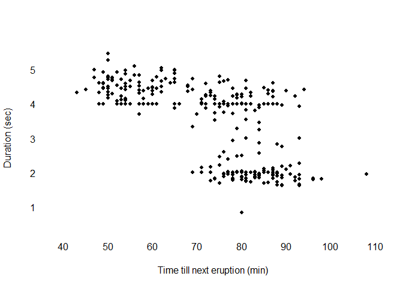
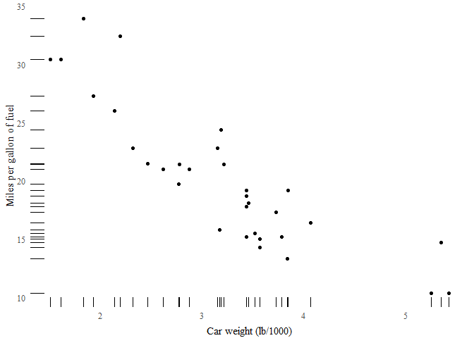

Visual Analytics Module 11 - Edward R. Tufte
================

``` r
x = geyser$waiting
y = geyser$duration

plot(x, y, main="", axes=FALSE, pch=16, cex=0.8,
     xlab="Time till next eruption (min)", ylab="Duration (sec)", 
     xlim=c(min(x)/1.1, max(x)), ylim=c(min(y)/1.5, max(y)))
axis(1, tick=F)
axis(2, tick=F, las=2)
```



First I have created a marginal histogram scatterplot using the default dataset 'geyser' in R. This plot compares the time of each geyser's next eruption to the duration of the eruption itself. This graph is not the most specific however it does a good job at showing a general distribution for each of the geysers and where most of the data lies.

``` r
ggplot(mtcars, aes(wt, mpg)) + geom_point() + geom_rug() + theme_tufte(ticks=F) + 
  xlab("Car weight (lb/1000)") + ylab("Miles per gallon of fuel") + 
  theme(axis.title.x = element_text(vjust=-0.5), axis.title.y = element_text(vjust=1))
```



The next graph I have created is a dot-dash plot comparing the amount of mpg each car got relative to its weight. I like this graph personally because it does a good job at showing the volume at specific integers as well as how dense a specific area of the distribution is.
